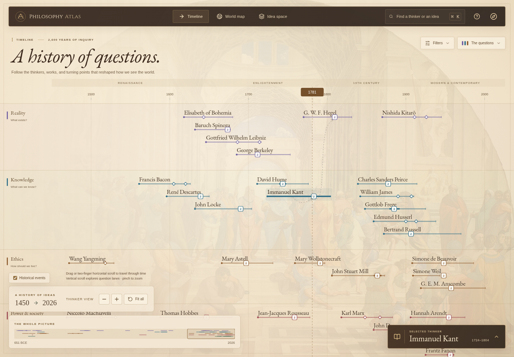
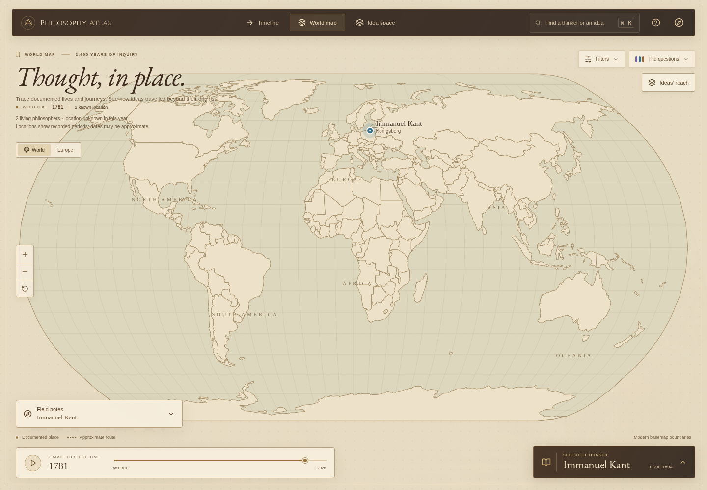
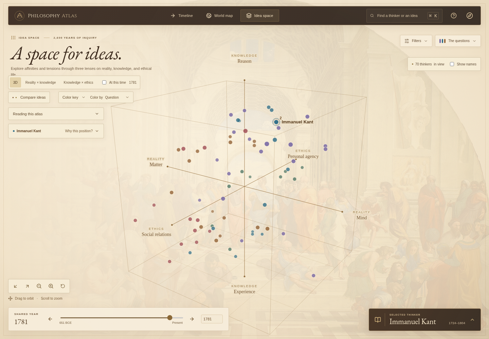

# An immersive historical atlas

The timeline, world map, and idea space occupy the entire viewport. Navigation and reading tools float above them. Opening an overlay never changes the canvas dimensions, so a selected position stays in place.

## Visual direction

A warm parchment ground, dark umber navigation, restrained gold borders, engraved geography, and classical typography suggest an atlas or a Renaissance reading room. Raphael's _The School of Athens_ appears as a faint decorative backdrop, with a lighter treatment behind the map. The artwork has no role in encoding data: question colors, dates, positions, and geographic marks retain their meanings.

Three museum websites were inspected in a browser:

- [The Metropolitan Museum of Art](https://www.metmuseum.org): artwork takes visual priority, with restrained navigation and expressive serif typography.
- [Uffizi Galleries](https://www.uffizi.it/en): clear navigation and labels make rich historical imagery approachable.
- [Rijksmuseum](https://www.rijksmuseum.nl/en): a collection-first canvas can establish a sense of place before adding reading tools.

These references informed the hierarchy and use of space. The interface does not reproduce their layouts or assets.

## Exploring and reading

- Chart selections update a compact **Selected thinker** reading tab. The reader expands on request; a reader that is already open follows the selection. Search opens the reader directly.
- Filters and the question key are expandable overlays. They close the shared reading drawer so the controls remain available.
- Map **Field notes** disclose documented journeys and qualitative reception. Enabling **Ideas’ reach** opens the relevant notes. Portrait screens initially focus the selected recorded place; **World** and reset restore the global view.
- Idea-space color keys, editorial notes, placement explanations, and comparisons are expandable overlays. Comparisons and long notes scroll inside their panels.
- The timeline scrolls vertically through the five question lanes. Its introductory title disappears after vertical scrolling to prevent text collisions. Horizontal pan and pinch retain their original time and zoom meanings.
- Escape closes shared overlays and returns focus from the reading drawer to its tab. Help and methodology remain available in the top navigation, including on phones.

Full philosopher names, uncertain dates, sources, and rationale remain available in the reading tools. Some dense timeline labels near viewport boundaries still require panning or zooming.

## Bundled assets

The fresco is Raphael's _The School of Athens_, 1509–1511. The [Wikimedia Commons reproduction](https://commons.wikimedia.org/wiki/File:La_scuola_di_Atene.jpg) was downloaded as a 1280px image; the Commons metadata identifies it as **public domain**. A credit and source link also appear in the methodology dialog.

EB Garamond and Cinzel are bundled locally under the SIL Open Font License. Their license files are included in `public/fonts/`. There are no runtime requests to museum sites, Wikimedia, or font services.

The redesign preserves the research collection and its source-verification flags. Its historical visual language is an aesthetic choice, not a claim that every tradition shares European origins.

## Production previews

[Portrait phone preview](images/ideas-mobile.png)
